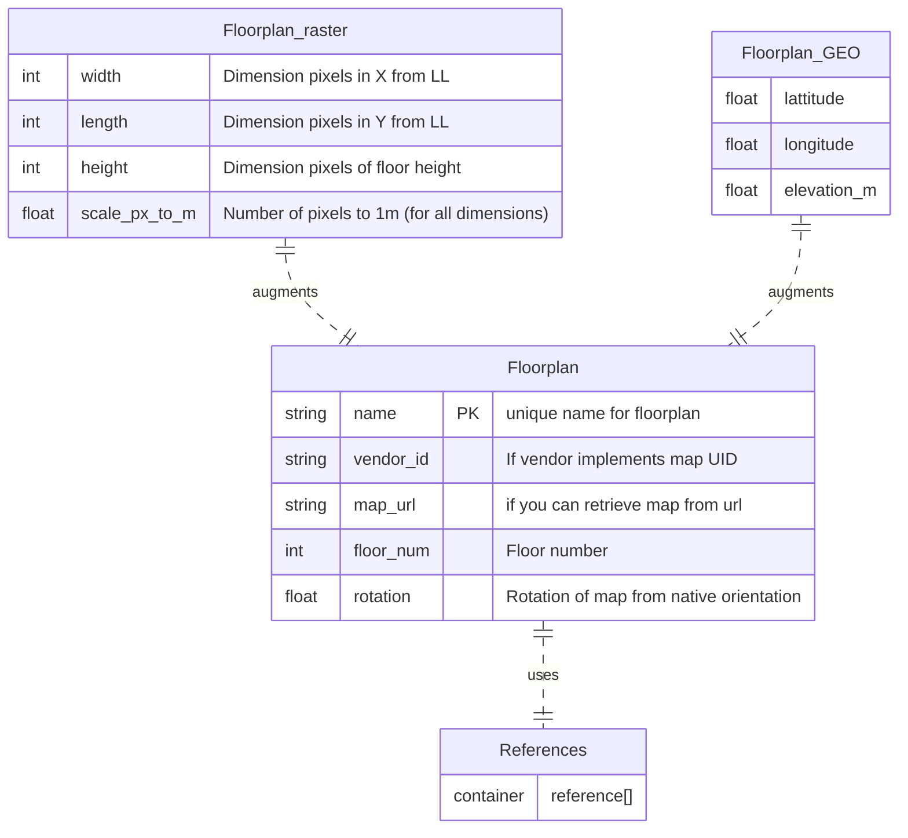
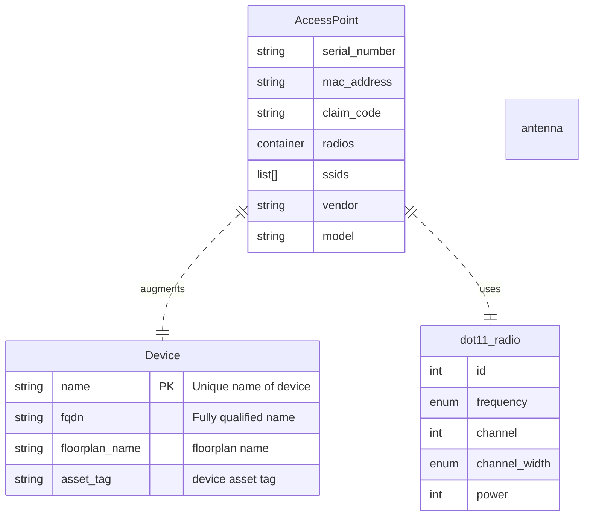
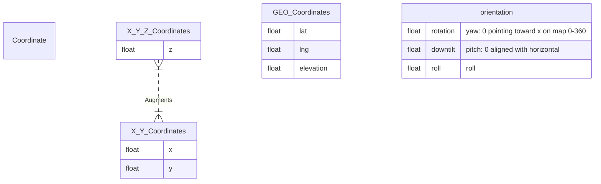

# Model Ideas Feb-2023

This is just a place to track model ideas that include some visual components.

## Top level Models

### Floorplan
In order to reference which floorplan the AP lives on, we need to establish the floorplan object.

Requirements:
 * dimensions in a coordinate schema
 * references between coordinate systems

 `openintent-floorplan.yang`

### Device and accessPoint

`openintent-access-point.yang`

