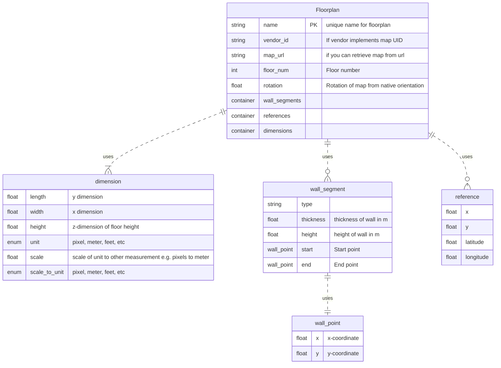
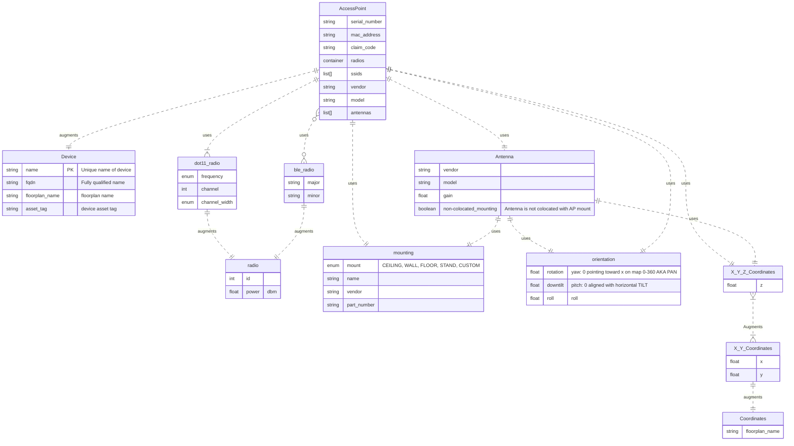
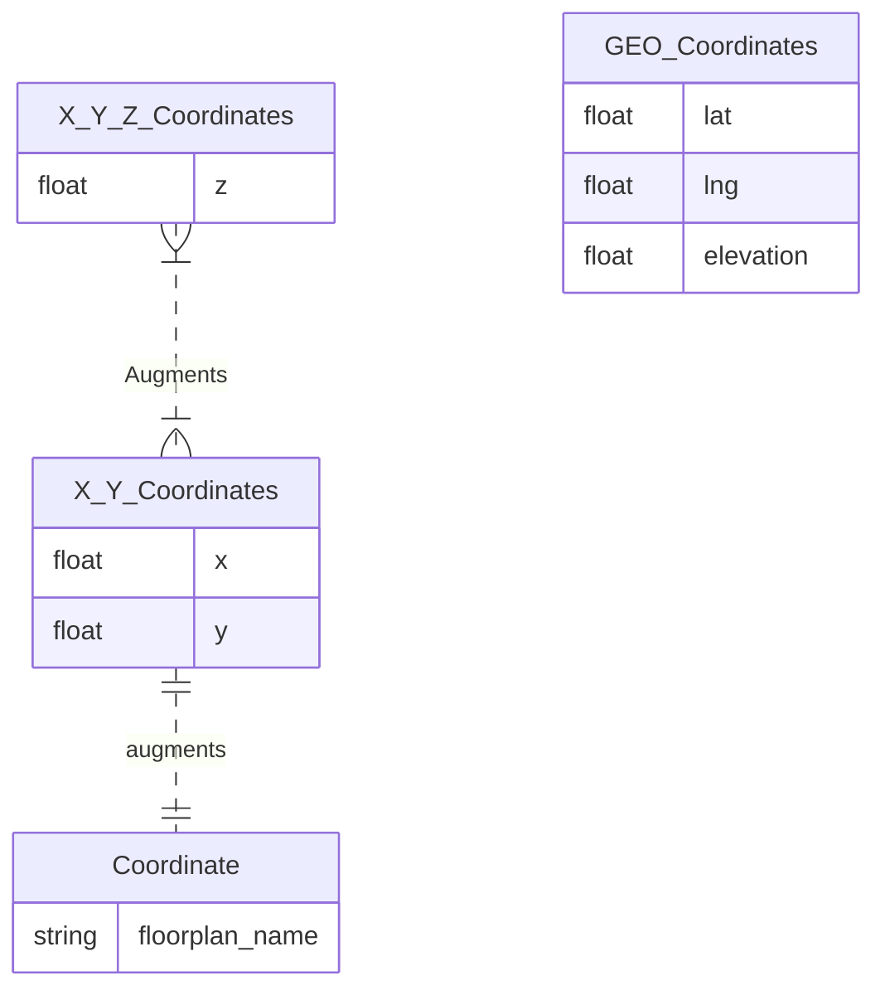

# Model Ideas Feb-2023

This is just a place to track model ideas that include some visual components.


## Floorplan
In order to reference which floorplan the AP lives on, we need to establish the floorplan object.

Requirements:
 * references points to convert between coordinate systems
 * Wall segments and walls
 * Some sort of coordinate reference
 * Dimensions and units

 `openintent-floorplan.yang`



## Device and accessPoint

`openintent-access-point.yang`



## Coordinate Systems playground.



```yaml
---
access-point:
    - name: device_01
      fqdn: device_01.corp.com
      floorplan:
        $ref": /schemas/floorplan
      asset_tag: abc0123456
      serial_number: az123456789
      mac_address: 00:00:00:00:00:00
      claim_code: abcdefg123
      ssids:
        - ssid_1
        - ssid_2
        - ssid_3
      vendor: arisco
      model: AP123


```

## Access-point json-schema


```yaml
---
    $id: https://example.com/schema/access-point
    $schema: https://json-schema.org/draft/2020-12/schema
    description: representation of an access-point
    type: object
    properties:
        name:
            type: string
            description: unique name of access point.
        floorplan_name:
            type: string
            description: name of floorplan to which this access-point belongs.
        asset_tag:
            type: string
            description: asset tag belonging to this access point.
        serial_number:
            type: string
            description: serial number of this access point.
        mac_address:
            type: string
            description: mac address of this access point.
        manufacturer:
            type: string
            description: the manufacturer name for this access point.
        model:
            type: string
            description: the model number of this particular access point
        sku:
            type: string
            description: sku part number for this specific access-point.
        radios:
            type: array
            items:
                $ref: https://example.com/schema/radio.json
        ssids:
            type: array
            items:
                type: string
        antennas:
            type: array
            items:
                $ref: https://example.com/schema/antenna.json

```
## floorplan json-schema

```yaml
---
$id: https://example.com/schema/floorplan
$schema: https://json-schema.org/draft/2020-12/schema
description: representation of an floorplan
type: object
properties:
    name:
        type: string
        description: unique name of floorplan
    vendor_id:
        type: string
        description: vendor's ID for this floorplan
    map_url:
        type: string
        description: url endpoint of where to retrieve the map.
    floor_id:
        type: string
        description: string representation of the floor id.
    rotation:
        type: number
        description: rotation of the floorplan from native orientation
    dimensions:
        type: array
        description: dimensions of the floorplan
        items:
            $refs: "#/$defs/dimension"
$defs:
    dimension:
        type: object
        properties:
            length:
                type: number
                description: y-dimension of the floorplan
            width:
                type: number
                description: x-dimension of the floorplan
            height:
                type: number
                description: z-dimension of the floor (default height)
            unit:
                type: string
                description: the dimension unit for length, width, height.
                enum:
                    - pixel
                    - meter
                    - feet

```

```yaml
$id: https://example.com/schema/floorplan
$schema: https://json-schema.org/draft/2020-12/schema
description: representation of an floorplan
type: object
properties:
    name:
        type: string
    vendor_id:
        type: string
    map_url:
        type: string
    floor_id:
        type: string
    rotation:
        type: number
    dimensions:
        type: array
        items:
            $refs: "#/$defs/dimension"
$defs:
    dimension:
        type: object
        properties:
            length:
                type: number
            width:
                type: number
            height:
                type: number
            unit:
                type: string
                enum:
                    - pixel
                    - meter
                    - feet
```


```json
{
  "$id": "https://example.com/schema/floorplan",
  "$schema": "https://json-schema.org/draft/2020-12/schema",
  "description": "representation of an floorplan",
  "type": "object",
  "properties": {
    "name": {
      "type": "string"
    },
    "vendor_id": {
      "type": "string"
    },
    "map_url": {
      "type": "string"
    },
    "floor_id": {
      "type": "string"
    },
    "rotation": {
      "type": "number"
    },
    "dimensions": {
      "type": "array",
      "items": {
        "$refs": "#/$defs/dimension"
      }
    }
  },
  "$defs": {
    "dimension": {
      "type": "object",
      "properties": {
        "length": {
          "type": "number"
        },
        "width": {
          "type": "number"
        },
        "height": {
          "type": "number"
        },
        "unit": {
          "type": "string",
          "enum": [
            "pixel",
            "meter",
            "feet"
          ]
        }
      }
    }
  }
}
```