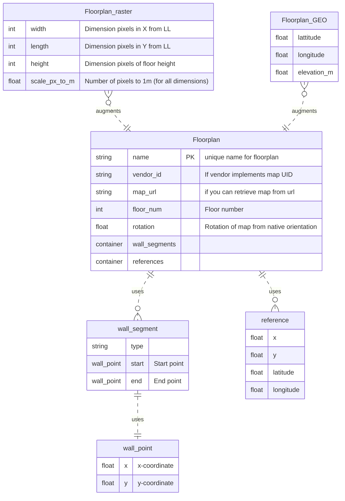
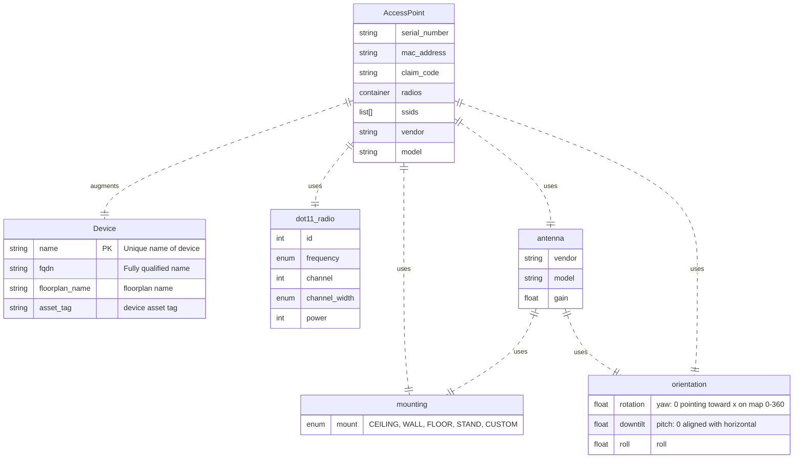
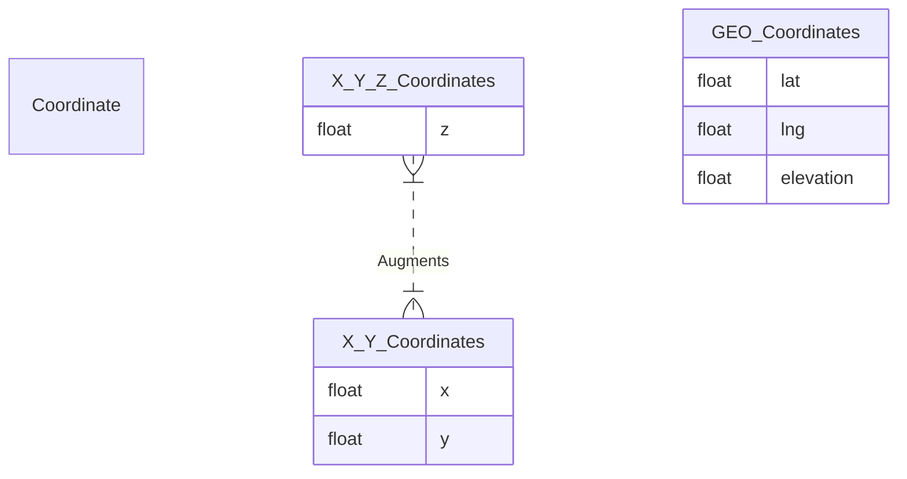

# Model Ideas Feb-2023

This is just a place to track model ideas that include some visual components.

## Floorplan
In order to reference which floorplan the AP lives on, we need to establish the floorplan object.

Requirements:
 * references to convert between coordinate systems
 * Wall segments and walls
 * Some sort of coordinate reference

 `openintent-floorplan.yang`

## Device and accessPoint

`openintent-access-point.yang`

## Coordinate System Work
